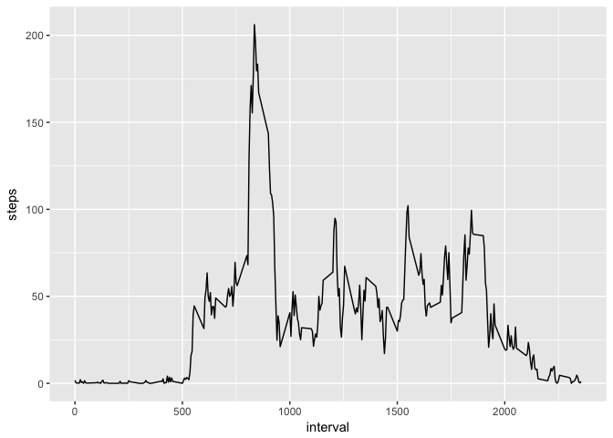

## Loading and preprocessing the data  
First we need to unzip and load the data using the code as following

```r
unzip("activity.zip")
dat <- read.csv("activity.csv")
```
  
Now lets have a peer of what the data looks like

```r
str(dat)
```

```
## 'data.frame':	17568 obs. of  3 variables:
##  $ steps   : int  NA NA NA NA NA NA NA NA NA NA ...
##  $ date    : Factor w/ 61 levels "2012-10-01","2012-10-02",..: 1 1 1 1 1 1 1 1 1 1 ...
##  $ interval: int  0 5 10 15 20 25 30 35 40 45 ...
```


## What is mean total number of steps taken per day?

```r
library(ggplot2)
ts <- aggregate(steps~date, dat, sum, rm.na = TRUE)
ggplot(data = ts, aes(x = date,y = steps) ) + geom_histogram(stat = "identity")
```

```
## Warning: Ignoring unknown parameters: binwidth, bins, pad
```

<!-- -->


```r
library(xtable)
tmean <- with(dat,tapply(steps,date,mean,rm.na = TRUE))
tmedian <- with(dat,tapply(steps,date,median,rm.na = TRUE))
xt1 <- xtable(as.data.frame(tmean))
xt2 <- xtable(as.data.frame(tmedian))
```
Here is the table for mean values

```r
print(xt1)
```

```
## % latex table generated in R 3.4.4 by xtable 1.8-2 package
## % Sun Apr  8 13:15:18 2018
## \begin{table}[ht]
## \centering
## \begin{tabular}{rr}
##   \hline
##  & tmean \\ 
##   \hline
## 2012-10-01 &  \\ 
##   2012-10-02 & 0.44 \\ 
##   2012-10-03 & 39.42 \\ 
##   2012-10-04 & 42.07 \\ 
##   2012-10-05 & 46.16 \\ 
##   2012-10-06 & 53.54 \\ 
##   2012-10-07 & 38.25 \\ 
##   2012-10-08 &  \\ 
##   2012-10-09 & 44.48 \\ 
##   2012-10-10 & 34.38 \\ 
##   2012-10-11 & 35.78 \\ 
##   2012-10-12 & 60.35 \\ 
##   2012-10-13 & 43.15 \\ 
##   2012-10-14 & 52.42 \\ 
##   2012-10-15 & 35.20 \\ 
##   2012-10-16 & 52.38 \\ 
##   2012-10-17 & 46.71 \\ 
##   2012-10-18 & 34.92 \\ 
##   2012-10-19 & 41.07 \\ 
##   2012-10-20 & 36.09 \\ 
##   2012-10-21 & 30.63 \\ 
##   2012-10-22 & 46.74 \\ 
##   2012-10-23 & 30.97 \\ 
##   2012-10-24 & 29.01 \\ 
##   2012-10-25 & 8.65 \\ 
##   2012-10-26 & 23.53 \\ 
##   2012-10-27 & 35.14 \\ 
##   2012-10-28 & 39.78 \\ 
##   2012-10-29 & 17.42 \\ 
##   2012-10-30 & 34.09 \\ 
##   2012-10-31 & 53.52 \\ 
##   2012-11-01 &  \\ 
##   2012-11-02 & 36.81 \\ 
##   2012-11-03 & 36.70 \\ 
##   2012-11-04 &  \\ 
##   2012-11-05 & 36.25 \\ 
##   2012-11-06 & 28.94 \\ 
##   2012-11-07 & 44.73 \\ 
##   2012-11-08 & 11.18 \\ 
##   2012-11-09 &  \\ 
##   2012-11-10 &  \\ 
##   2012-11-11 & 43.78 \\ 
##   2012-11-12 & 37.38 \\ 
##   2012-11-13 & 25.47 \\ 
##   2012-11-14 &  \\ 
##   2012-11-15 & 0.14 \\ 
##   2012-11-16 & 18.89 \\ 
##   2012-11-17 & 49.79 \\ 
##   2012-11-18 & 52.47 \\ 
##   2012-11-19 & 30.70 \\ 
##   2012-11-20 & 15.53 \\ 
##   2012-11-21 & 44.40 \\ 
##   2012-11-22 & 70.93 \\ 
##   2012-11-23 & 73.59 \\ 
##   2012-11-24 & 50.27 \\ 
##   2012-11-25 & 41.09 \\ 
##   2012-11-26 & 38.76 \\ 
##   2012-11-27 & 47.38 \\ 
##   2012-11-28 & 35.36 \\ 
##   2012-11-29 & 24.47 \\ 
##   2012-11-30 &  \\ 
##    \hline
## \end{tabular}
## \end{table}
```
Here is the table for median values

```r
print(xt2)
```

```
## % latex table generated in R 3.4.4 by xtable 1.8-2 package
## % Sun Apr  8 13:15:19 2018
## \begin{table}[ht]
## \centering
## \begin{tabular}{rr}
##   \hline
##  & tmedian \\ 
##   \hline
## 2012-10-01 &  \\ 
##   2012-10-02 & 0.00 \\ 
##   2012-10-03 & 0.00 \\ 
##   2012-10-04 & 0.00 \\ 
##   2012-10-05 & 0.00 \\ 
##   2012-10-06 & 0.00 \\ 
##   2012-10-07 & 0.00 \\ 
##   2012-10-08 &  \\ 
##   2012-10-09 & 0.00 \\ 
##   2012-10-10 & 0.00 \\ 
##   2012-10-11 & 0.00 \\ 
##   2012-10-12 & 0.00 \\ 
##   2012-10-13 & 0.00 \\ 
##   2012-10-14 & 0.00 \\ 
##   2012-10-15 & 0.00 \\ 
##   2012-10-16 & 0.00 \\ 
##   2012-10-17 & 0.00 \\ 
##   2012-10-18 & 0.00 \\ 
##   2012-10-19 & 0.00 \\ 
##   2012-10-20 & 0.00 \\ 
##   2012-10-21 & 0.00 \\ 
##   2012-10-22 & 0.00 \\ 
##   2012-10-23 & 0.00 \\ 
##   2012-10-24 & 0.00 \\ 
##   2012-10-25 & 0.00 \\ 
##   2012-10-26 & 0.00 \\ 
##   2012-10-27 & 0.00 \\ 
##   2012-10-28 & 0.00 \\ 
##   2012-10-29 & 0.00 \\ 
##   2012-10-30 & 0.00 \\ 
##   2012-10-31 & 0.00 \\ 
##   2012-11-01 &  \\ 
##   2012-11-02 & 0.00 \\ 
##   2012-11-03 & 0.00 \\ 
##   2012-11-04 &  \\ 
##   2012-11-05 & 0.00 \\ 
##   2012-11-06 & 0.00 \\ 
##   2012-11-07 & 0.00 \\ 
##   2012-11-08 & 0.00 \\ 
##   2012-11-09 &  \\ 
##   2012-11-10 &  \\ 
##   2012-11-11 & 0.00 \\ 
##   2012-11-12 & 0.00 \\ 
##   2012-11-13 & 0.00 \\ 
##   2012-11-14 &  \\ 
##   2012-11-15 & 0.00 \\ 
##   2012-11-16 & 0.00 \\ 
##   2012-11-17 & 0.00 \\ 
##   2012-11-18 & 0.00 \\ 
##   2012-11-19 & 0.00 \\ 
##   2012-11-20 & 0.00 \\ 
##   2012-11-21 & 0.00 \\ 
##   2012-11-22 & 0.00 \\ 
##   2012-11-23 & 0.00 \\ 
##   2012-11-24 & 0.00 \\ 
##   2012-11-25 & 0.00 \\ 
##   2012-11-26 & 0.00 \\ 
##   2012-11-27 & 0.00 \\ 
##   2012-11-28 & 0.00 \\ 
##   2012-11-29 & 0.00 \\ 
##   2012-11-30 &  \\ 
##    \hline
## \end{tabular}
## \end{table}
```
  
## What is the average daily activity pattern?

```r
is <- aggregate(steps~interval, dat, mean, rm.na = TRUE)
ggplot(data = is, aes(x = interval, y = steps)) + geom_line()
```

<!-- -->
  
The interval contains the maximum number of steps is [835, 840]


## Imputing missing values
In the previous analysis, we exclude all the cases which contain missing values. However, The presence of missing days may introduce bias into some calculations or summaries of the data and we need to take the bais into consideration. First of all, we need to find how many missing cases are there in our study. this can be achieved using following R code:  

```r
nmissing <- sum(!complete.cases(dat))
```
It appears that we have 2304 missing values.  

To address the effect of missing cases, we can replace all missing values with the mean of steps in that particular time interval.  

```r
replica <- merge(dat,is,by = "interval")
dat2<- dat
dat2$steps[!complete.cases(dat2)] <- replica$steps.y[!complete.cases(dat2)]
```
  
Lets now draw a new histogram which all missing values are imputed.  

```r
ts2 <- aggregate(steps~date, dat2, sum, rm.na = TRUE)
ggplot(data = ts2, aes(x = date,y = steps) ) + geom_histogram(stat = "identity")
```

```
## Warning: Ignoring unknown parameters: binwidth, bins, pad
```

<!-- -->
  
Now lets check the mean and median change  

```r
tmean2 <- with(dat2,tapply(steps,date,mean,rm.na = TRUE))
tmedian2 <- with(dat2,tapply(steps,date,median,rm.na = TRUE))
xt3 <- xtable(as.data.frame(tmean2))
xt4 <- xtable(as.data.frame(tmedian2))
```

Here is the table for new mean values

```r
print(xt3)
```

```
## % latex table generated in R 3.4.4 by xtable 1.8-2 package
## % Sun Apr  8 13:15:21 2018
## \begin{table}[ht]
## \centering
## \begin{tabular}{rr}
##   \hline
##  & tmean2 \\ 
##   \hline
## 2012-10-01 & 0.51 \\ 
##   2012-10-02 & 0.44 \\ 
##   2012-10-03 & 39.42 \\ 
##   2012-10-04 & 42.07 \\ 
##   2012-10-05 & 46.16 \\ 
##   2012-10-06 & 53.54 \\ 
##   2012-10-07 & 38.25 \\ 
##   2012-10-08 & 0.53 \\ 
##   2012-10-09 & 44.48 \\ 
##   2012-10-10 & 34.38 \\ 
##   2012-10-11 & 35.78 \\ 
##   2012-10-12 & 60.35 \\ 
##   2012-10-13 & 43.15 \\ 
##   2012-10-14 & 52.42 \\ 
##   2012-10-15 & 35.20 \\ 
##   2012-10-16 & 52.38 \\ 
##   2012-10-17 & 46.71 \\ 
##   2012-10-18 & 34.92 \\ 
##   2012-10-19 & 41.07 \\ 
##   2012-10-20 & 36.09 \\ 
##   2012-10-21 & 30.63 \\ 
##   2012-10-22 & 46.74 \\ 
##   2012-10-23 & 30.97 \\ 
##   2012-10-24 & 29.01 \\ 
##   2012-10-25 & 8.65 \\ 
##   2012-10-26 & 23.53 \\ 
##   2012-10-27 & 35.14 \\ 
##   2012-10-28 & 39.78 \\ 
##   2012-10-29 & 17.42 \\ 
##   2012-10-30 & 34.09 \\ 
##   2012-10-31 & 53.52 \\ 
##   2012-11-01 & 68.65 \\ 
##   2012-11-02 & 36.81 \\ 
##   2012-11-03 & 36.70 \\ 
##   2012-11-04 & 42.24 \\ 
##   2012-11-05 & 36.25 \\ 
##   2012-11-06 & 28.94 \\ 
##   2012-11-07 & 44.73 \\ 
##   2012-11-08 & 11.18 \\ 
##   2012-11-09 & 57.57 \\ 
##   2012-11-10 & 83.85 \\ 
##   2012-11-11 & 43.78 \\ 
##   2012-11-12 & 37.38 \\ 
##   2012-11-13 & 25.47 \\ 
##   2012-11-14 & 70.06 \\ 
##   2012-11-15 & 0.14 \\ 
##   2012-11-16 & 18.89 \\ 
##   2012-11-17 & 49.79 \\ 
##   2012-11-18 & 52.47 \\ 
##   2012-11-19 & 30.70 \\ 
##   2012-11-20 & 15.53 \\ 
##   2012-11-21 & 44.40 \\ 
##   2012-11-22 & 70.93 \\ 
##   2012-11-23 & 73.59 \\ 
##   2012-11-24 & 50.27 \\ 
##   2012-11-25 & 41.09 \\ 
##   2012-11-26 & 38.76 \\ 
##   2012-11-27 & 47.38 \\ 
##   2012-11-28 & 35.36 \\ 
##   2012-11-29 & 24.47 \\ 
##   2012-11-30 & 1.83 \\ 
##    \hline
## \end{tabular}
## \end{table}
```
Here is the table for new median values

```r
print(xt4)
```

```
## % latex table generated in R 3.4.4 by xtable 1.8-2 package
## % Sun Apr  8 13:15:21 2018
## \begin{table}[ht]
## \centering
## \begin{tabular}{rr}
##   \hline
##  & tmedian2 \\ 
##   \hline
## 2012-10-01 & 0.15 \\ 
##   2012-10-02 & 0.00 \\ 
##   2012-10-03 & 0.00 \\ 
##   2012-10-04 & 0.00 \\ 
##   2012-10-05 & 0.00 \\ 
##   2012-10-06 & 0.00 \\ 
##   2012-10-07 & 0.00 \\ 
##   2012-10-08 & 0.00 \\ 
##   2012-10-09 & 0.00 \\ 
##   2012-10-10 & 0.00 \\ 
##   2012-10-11 & 0.00 \\ 
##   2012-10-12 & 0.00 \\ 
##   2012-10-13 & 0.00 \\ 
##   2012-10-14 & 0.00 \\ 
##   2012-10-15 & 0.00 \\ 
##   2012-10-16 & 0.00 \\ 
##   2012-10-17 & 0.00 \\ 
##   2012-10-18 & 0.00 \\ 
##   2012-10-19 & 0.00 \\ 
##   2012-10-20 & 0.00 \\ 
##   2012-10-21 & 0.00 \\ 
##   2012-10-22 & 0.00 \\ 
##   2012-10-23 & 0.00 \\ 
##   2012-10-24 & 0.00 \\ 
##   2012-10-25 & 0.00 \\ 
##   2012-10-26 & 0.00 \\ 
##   2012-10-27 & 0.00 \\ 
##   2012-10-28 & 0.00 \\ 
##   2012-10-29 & 0.00 \\ 
##   2012-10-30 & 0.00 \\ 
##   2012-10-31 & 0.00 \\ 
##   2012-11-01 & 63.40 \\ 
##   2012-11-02 & 0.00 \\ 
##   2012-11-03 & 0.00 \\ 
##   2012-11-04 & 42.75 \\ 
##   2012-11-05 & 0.00 \\ 
##   2012-11-06 & 0.00 \\ 
##   2012-11-07 & 0.00 \\ 
##   2012-11-08 & 0.00 \\ 
##   2012-11-09 & 48.13 \\ 
##   2012-11-10 & 83.96 \\ 
##   2012-11-11 & 0.00 \\ 
##   2012-11-12 & 0.00 \\ 
##   2012-11-13 & 0.00 \\ 
##   2012-11-14 & 72.72 \\ 
##   2012-11-15 & 0.00 \\ 
##   2012-11-16 & 0.00 \\ 
##   2012-11-17 & 0.00 \\ 
##   2012-11-18 & 0.00 \\ 
##   2012-11-19 & 0.00 \\ 
##   2012-11-20 & 0.00 \\ 
##   2012-11-21 & 0.00 \\ 
##   2012-11-22 & 0.00 \\ 
##   2012-11-23 & 0.00 \\ 
##   2012-11-24 & 0.00 \\ 
##   2012-11-25 & 0.00 \\ 
##   2012-11-26 & 0.00 \\ 
##   2012-11-27 & 0.00 \\ 
##   2012-11-28 & 0.00 \\ 
##   2012-11-29 & 0.00 \\ 
##   2012-11-30 & 1.08 \\ 
##    \hline
## \end{tabular}
## \end{table}
```
  
Here we can conclude that imputing the missing value in this way will sligtly increase the mean and median.  

## Are there differences in activity patterns between weekdays and weekends?  
Here we want to examine if the patterns differ between weekdays and weekend. Firstly we should label all observations to identify them as either "Weekday" or "Weekend".  

```r
abbre <- weekdays(as.Date(dat2$date))
abbre[abbre %in% c("Saturday","Sunday") ] <- "Weekend"
abbre[abbre %in% c("Monday","Tuesday","Wednesday","Thursday","Friday")] <- "Weekday"
dat3 <- cbind(dat2,as.data.frame(abbre))
```
  
Now we can drow the panel plot on both weekdays and weekend to see if there is a big difference  

```r
is3 <- aggregate(steps~abbre+interval, dat3, mean, rm.na = TRUE)
ggplot(data = is3, aes(x = interval, y = steps)) + geom_line()+facet_grid(abbre~.)
```

<!-- -->

```r
## Alternative method
## ggplot(data = dat3, aes(x = interval, y = steps)) + stat_summary(fun.y = mean,geom = "line") + facet_grid(abbre~.)
```


